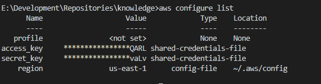

# AWS 

##### Configuring AWS CLI
* Step 1: Get User Details
  * Get _**AWS Access Key Id**_ and **Secret Access Key**
* Step 2: Install aws cli
  * Windows:
    > ```choco install awscli ```
  * MacOS
    > ``` brew install awscli ```
* Step 3: Verify installation
  * Run
    >  ``` aws --version ```
  * Sample Output : 
    > ``` aws-cli/2.2.41  ```
* Step 4: Configure
  * If this is first profile, run 
    > ``` aws configure ```
  * If you already have different profiles create new profile
    > ``` aws configure --profile <PROFILE_NAME> ```
  * Provide above details **AWS Access Key Id** ,  **Secret Access Key** and **Region**
* Step 5: Verify configuration
  * Run ``` aws configure list ```
  * Alternatively if you have multiple profiles, run ``` aws configure list --profile <PROFILE_NAME>```
  * Sample Output 
  
 
> **NOTE:** The aws configure creates two files ~/.aws/configure and ~/.aws/credentials.  --profile <ProfileName> option with aws command instructs aws cli to run command agains specified account.

##### AWS CLI Commands
* Commands Syntax
  > _**aws**_ _[Servoce]_ _[Action]_
* Example
  > aws lambda create-function

* List configurations 
  > ``` aws configure list --profile <ProfileName> ```


##### References
* Official AWS CLI Commands reference: 
  > [Command Refererence](https://awscli.amazonaws.com/v2/documentation/api/latest/index.html)

