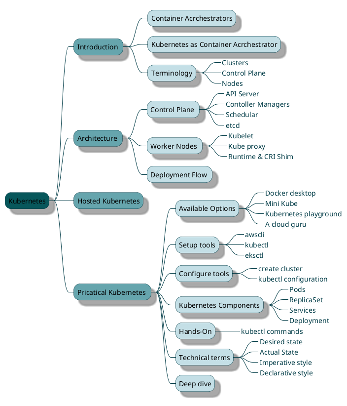
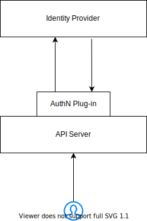

<style>
    primary { color: #07575B }
    secondary { color: #66A5AD }
    tertiary { color: #C4DFE6 }
    lineColor { color: #003B46 }
</style>




# Introduction

#### Containers
We know containers are awsome.... becasuse they provided us with the benefits like:
* **Environmental consistency:** If application is running fine on my local machine it will run fine in cloud as well, beacuse containers let you pack your application with environement.
* **Resource isolation**: Provides predictable application performance.
  * Allowed independent pieces of application can be scalled 
 
Containers are awsome .. however as teams create more and more containers to run applications.. its more and more challenging to manage things like
* Controlling storage for them
* Making sure that they get created on right set of machines
* Discovering them on network

Container archestrators were created to solve this problem.

 #### Container archestrators
 * They manage machines (Physical or Virtual machines) that create and run containers
 * And create and Manage those containers

There are many exaples of container archestrators, however Kubernetes is by far the most popular option

#### Kubernetes as Container archestrators

As I said Kubernetes as Container archestrator manages physical machines or virtual machines.  We know different clouds call these virtual machines differently.
* AWS calls them EC2
* Azure calls them Virtual Machines
* GCP calls them Compute Entines

What does Kubernetes call them?

Kubernetes uses very generic to describe these machines.... it calls them **Nodes**

When your application is running on 100s or 1000s of Nodes ... As in Master/Slave architecture   What kubernetes does is ... it chooses one of the node as Mater node to manaage rest of the nodes. 

* Kubernetes call these master nodes as **Mater Nodes / Control plane**
* Other nodes that take the workload are called **Worker Nodes/ Node**
* Master node(s) and Worker Nodes together called **Cluster**

Generally there will be only one Master node in a cluster but in certain cases where we need more availability there can be multiple Master node.

Lets dive-in and see how these 

## Architecture


#### Control Plane

Control plane is the brain of Kubernetes and makes all the decisions.  

* **API Server:** 
This is the front-end of Kubernetes. It exposes REST API for interaction and the iteration and directs the communication across the system. Communication is always through API Server. Be it a deployment scripts running in jenkins, GitLab, Helm or a user interacting with CLI like Kubectl or any management console like Rancher, Kubens.  

* **etcd:**
It is light weight key-value datastore used for maintaining the entire state of the cluster.

* **Schedular:**
Identifies appropriate node to your workload and shedules it to the node.

* **Controller Managers:**
Controller Managers are controll loops.  They are like CC cameras.  They alway watch for the current state of the workload and modifies the state to desired state if required. 

#### Woker Nodes
Every Worker Nodes runs with 3 major components
* **Kubelet**
This is kubernetes agent. Initially it talks to control plane gives the information like CPU, RAM availble to Node, so that work can be scheduled to the Node. And listens to control plane for new tasks that it needs to run and reports back the status. And all this communication happens with **API server** on control plane

* **Container Runtime**
We know that the workers nodes are where our applications run.  So we need a container runtime to run our application in containers.  Intially Kubernetes opted Docker as the container runtime. But now it can support any container runtime which is CRI (Container Runtime Interface)

* **Service Proxy/ Kube Proxy**
This is the component that makes the kubernetes networking works.  When you run your applications on cluster, we need a network that spans across nodes even though so that all your application can talk to each other. Service poxy makes this magic happen.

#### Deployment Flow 
Kubernetes like us describe things declaratively.  
>
> ```
> - 10 copies of XYZ service
> - PQR Image
> - Port 8080
> - "env=prod" label
> ```
> 
Technical term for this is _**Desired State**_.  We write this in a config file and we give it to kubernetes and say Hey kubernetes make this happen please.
If you see this sudo we are not specifying any commands to pull images, to start containers, add them to network, expose port number, add some tags/labels.  Compare this with humongus script with all those commands and logic. The technical term for this way of describing is called _**Declarative**_ way.


## Hosted Kubernetes

When we see the architecture we have Control Plane and Worker Nodes.  In this application focused world we only care about Nodes that run applications.  We do not want to spend time and effort planing high availability, performanace stuff.  And we do not want them get in the way.


That is when we move to cloud, where things are managed by cloud provider.
Similarly when you host your kubernetes in Cloud, be it  Amazon EKS ( Elastic Kubernetes Service), AKS (Azure Kubernetes Service) or GKE (Google Kubernetes Engine) platform manages the your master node.


#### Authentication

Kubernetes does not have first-class notion for human users, but rather assumes the users are managed outside kubernetes via LDAP, SSO, SAML or Kerberos.

The API server uses one of the configured authentication plugins
(you can enable multiple) to establish the identity with an
identity provider.

The API server uses one of the configured authentication plugins
(you can enable multiple) to establish the identity with an
identity provider.



