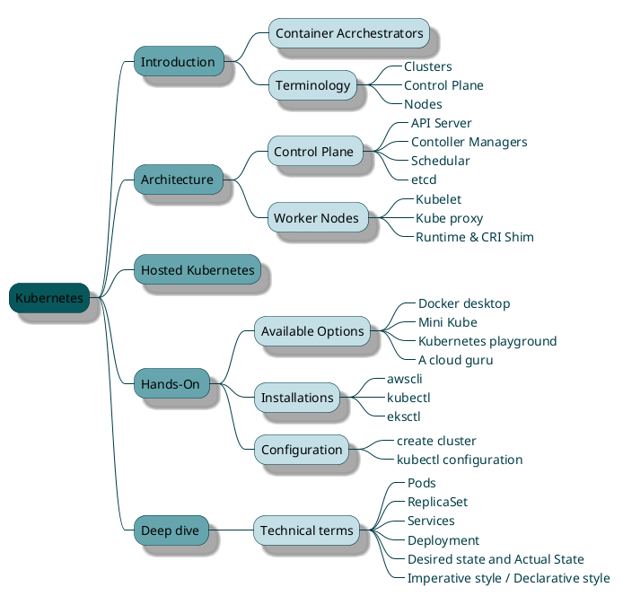

<style>
    primary { color: #07575B }
    secondary { color: #66A5AD }
    tertiary { color: #C4DFE6 }
    lineColor { color: #003B46 }
</style>

## <primary> Kubernetes 

### <secondary> Agenda



### <secondary> Architecture


### <secondary> Hosted Kubernetes


### <secondary> 1. Hands-On

#### <secondary> a. Installations
##### awscli
##### eksctl
  * Installation
    * Windows
      > ``` choco install eksctl ```
    * MacOS
        >  ```
        > brew tap weaveworks/tap
        > brew install weaveworks/tap/eksctl
        > ```
  * Verify
    > ``` shell
    > eksctl version
    > ```

##### kubectl
  * Installation
    * Windows
      > ``` shell 
      > choco kubectl
      > ```
    * MasOS
      > ``` shell
      > brew install kubectl
      > ```
  * Verify
    > ``` shell
    > kubectl version --output=json
    > ```

#### <secondary> b. Confugration
##### <secondary> Create Cluster
  * Command:  
    * Syntax: 
      > 
      > ``` shell
      > eksctl create  cluster <OPTIONS>
      > ```
    * OPTIONS
        > ```
        > OPTIONS : 
        >    --name <RESOURCE_NAME>
        >    --region <REGION>
        >    --nodegroup-name <GROUP_NAME>
        >    --node-type <NODE_TYPE>
        >    --nodes <NUMBER_OF_NODES>
        >    --min-nodes <NUMBER_OF_NODES>
        >    --max-nodes <NUMBER_OF_NODES>
        > FLAGS:   
        >    --managed
        >    --asg-access 
        > ```
    * Example:
        > ``` shell 
        > eksctl create  cluster \
        > --name kube-demo-cluster \
        > --region us-east-1a \
        > --nodegroup-name kube-demo-nodegroup \
        > --node-type t2.micro \
        > --nodes 2 \
        > --min-nodes 2 \
        > --max-nodes 3 \
        > --managed --asg-access
        > ```
##### <secondary> _kubectl_ configuration

### <secondary> Deep dive

**Declarative**:

> ```
> - 10 copies of XYZ service
> - PQR Image
> - Port 8080
> - "env=prod" label
> ```


**Sample config file** : 
> **File**: _deployment.yml_
> 
> ``` yml
> apiVersion: apps/v1
> kind: Deployment
> metadata:
> name: kube-demo-deployment
> spec:
>   selector:
>     matchLabels:
>     app: kube-demo
> replicas: 3
> template:
>   metadata:
>     labels:
>       app: kube-demo
>     spec:
>       containers:
>         - name: kube-demo-ctnr
>         image: deepaksama26/kube-demo:0.0.4-SNAPSHOT
>         ports:
>           - containerPort: 80
> ```